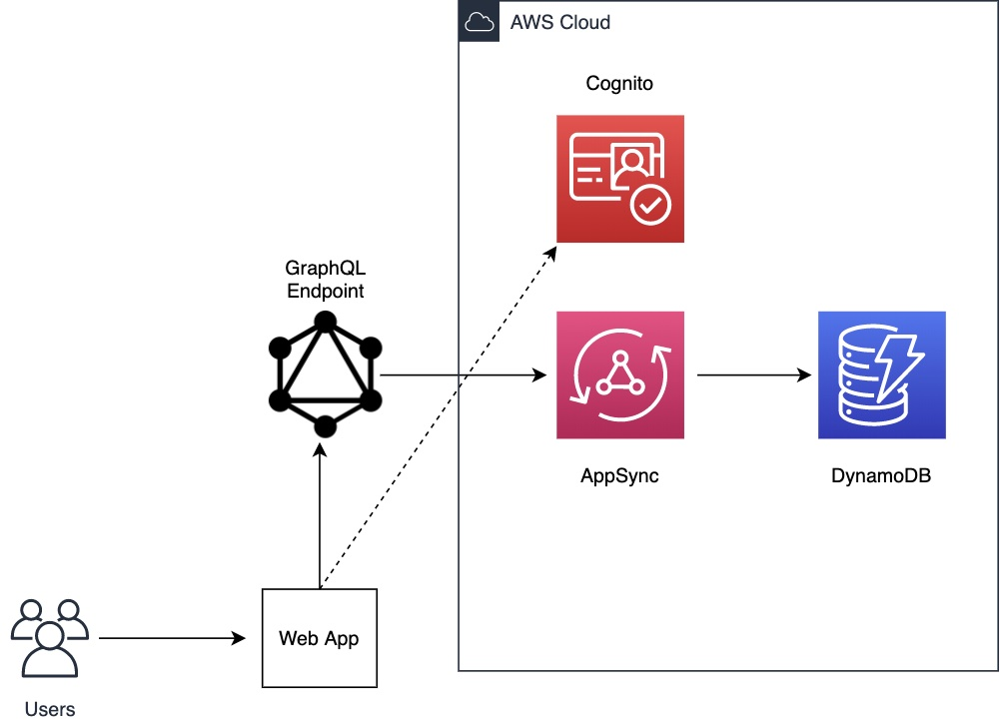

# React Kanban app.

React.js app deployed with AWS Amplify.
This project was bootstrapped with [Create React App](https://github.com/facebook/create-react-app) and [AWS Amplify](https://aws.amazon.com/amplify/)

## Architecture

A simple Amplify+React frontend architecture 

## Available Scripts

In the project directory, you can run:

### `npm install`

Installs local dependencies

### `amplify init`

Loads the infrastructure needed for the application.

### `npm start`

Runs the app in the development mode.\
Open [http://localhost:3000](http://localhost:3000) to view it in the browser.

## Demo deployed to

[Demo App](https://dev.d2c5lurc2esl9w.amplifyapp.com)
